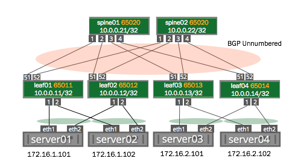

Demo MLAG Configurations
========================
This Github repository contains the configuration files necessary for setting up Multi-Chassis Link Aggregation using Cumulus Linux and Quagga on the [Reference Topology](http://github.com/cumulusnetworks/cldemo-vagrant).

The flatfiles in this repository will set up a BGP unnumbered routing fabric between the leafs and spines, and will configure MLAG between the two top-of-rack switches and the two servers in that rack. A helper script named `push-config.py` is available to quickly deploy the flatfiles to the devices in the network, but you could just as easily copy and paste them by hand or incorporate them into an automation tool instead.

Quickstart: Run the demo
------------------------
Before running this demo, install [VirtualBox](https://www.virtualbox.org/wiki/Download_Old_Builds) and [Vagrant](https://releases.hashicorp.com/vagrant/). The currently supported versions of VirtualBox and Vagrant can be found on the [cldemo-vagrant](https://github.com/cumulusnetworks/cldemo-vagrant).

    git clone https://github.com/cumulusnetworks/cldemo-vagrant
    cd cldemo-vagrant
    vagrant up oob-mgmt-server oob-mgmt-switch 
    vagrant up leaf01 leaf02 leaf03 leaf04 spine01 spine02 server01 server02 server03 server04
    vagrant ssh oob-mgmt-server
    sudo su - cumulus
    git clone https://github.com/cumulusnetworks/cldemo-config-mlag
    cd cldemo-config-mlag
    ansible-playbook deploy.yml
    ssh server01
    ping 172.16.2.101

Topology
--------
This demo runs on a spine-leaf topology with two dual-attached hosts. The ansible playbook deploy.yml requires an out-of-band management network that provides access to eth0 on all of the in-band devices.

